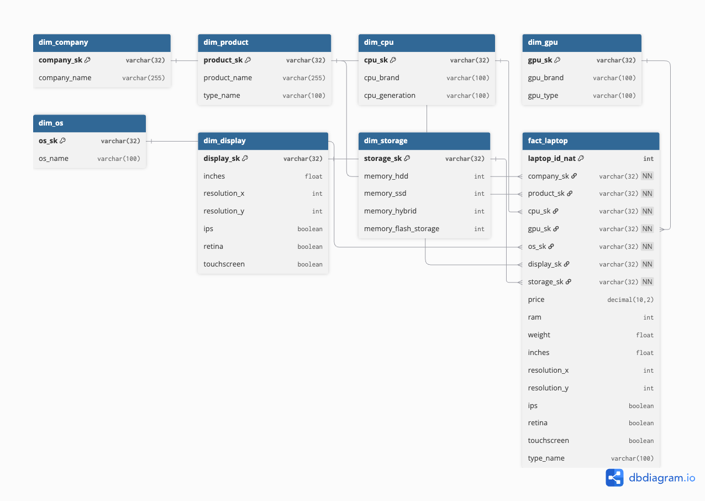

# 🖥️ Laptop Data Modeling with dbt

## 📌 Project Idea
This project takes a dataset of laptop specifications and prices, and transforms it into a **star schema** using **dbt**.  
The goal is to showcase how to go from raw data → preprocessing → database → dbt models → clean data warehouse design.

It’s a great starting project for anyone learning **dbt** and **data modeling**.

---

## 🔄 Workflow

1. **Raw dataset**  
   - `laptops.csv` (original dataset with messy formats)

2. **Preprocessing (Python/Jupyter)**  
   - Converted RAM, weight, memory, etc. into numeric columns  
   - Extracted CPU/GPU brands, display flags (IPS, Touchscreen, Retina), resolutions, PPI  
   - Normalized OS types  
   - Exported as `laptop_cutted.csv`

3. **Database (Postgres / pgAdmin)**  
   - Loaded preprocessed data into a staging table: `stg_laptops`

4. **dbt source definition**  
   - Declared `stg_laptops` in `sources.yml`  
   - Example:
     ```jinja
     {{ source('base', 'stg_laptops') }}
     ```

5. **Staging model**  
   - `stg_laptops_clean.sql` → cleans and standardizes raw staging data.

6. **Dimension models**  
   - `dim_company.sql`  
   - `dim_product.sql`  
   - `dim_cpu.sql`  
   - `dim_gpu.sql`  
   - `dim_os.sql`  
   - `dim_display.sql`  
   - `dim_storage.sql`

   Each dimension creates a **surrogate key (SK)** using `md5()` and stores cleaned attributes.

7. **Fact table**  
   - `fact_laptop.sql`  
   - Grain: **one row per laptop**  
   - Holds foreign keys to each dimension + measures (price, RAM, weight, etc.)

8. **Tests**  
   - Defined in `schema.yml`  
   - Ensures:
     - SKs are unique & not null  
     - Fact table foreign keys correctly map to dimensions  
   - ✅ All tests passed

9. **ERD**  
   - Star schema diagram created with DBML  
   - File: `docs/laptops_erd.dbml`  
   - Rendered ERD (example below):

   

---

## 📊 Schema Overview

- **Fact Table**
  - `fact_laptop` → One row per laptop. Links to all dimensions and contains measures (price, RAM, weight, etc.).

- **Dimension Tables**
  - `dim_company` → Laptop brand/manufacturer (Apple, Dell, HP, etc.).
  - `dim_product` → Product model and category (MacBook Pro, Ultrabook, Notebook, etc.).
  - `dim_cpu` → CPU brand and generation/family (Intel i5, i7, Ryzen, etc.).
  - `dim_gpu` → GPU brand and type (NVIDIA GeForce, Intel Iris, AMD Radeon, etc.).
  - `dim_os` → Operating system (Windows, macOS, Linux, No OS).
  - `dim_display` → Screen attributes (size, resolution, IPS, Retina, Touchscreen).
  - `dim_storage` → Storage breakdown (HDD, SSD, Hybrid, Flash capacities).

Together they form a **star schema** for analyzing laptops by company, product, CPU/GPU, OS, storage, and display.


---

## 🧪 Data Quality

Tests included:
- **Unique & not null** constraints on all dimension SKs  
- **Fact → Dim relationships** for referential integrity  
- **Fact grain check**: `laptop_id_nat` unique & not null  

All tests passed, ensuring the schema is clean and reliable.

---

---

## 🚀 How to Run

1. Clone this repo
   ```bash
   git clone https://github.com/yourusername/laptop-dbt-project.git
   cd laptop-dbt-project
